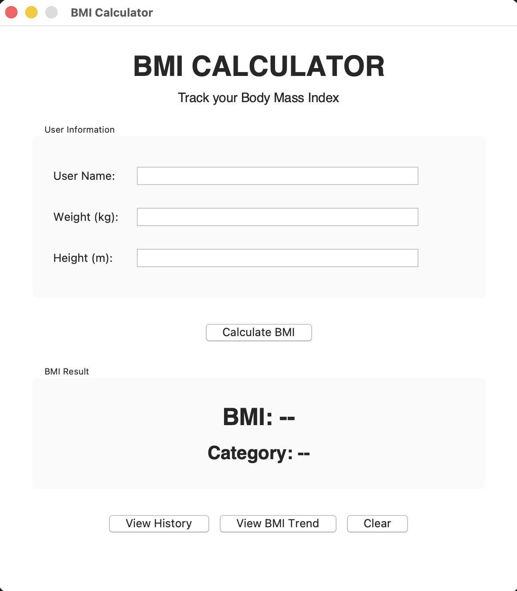
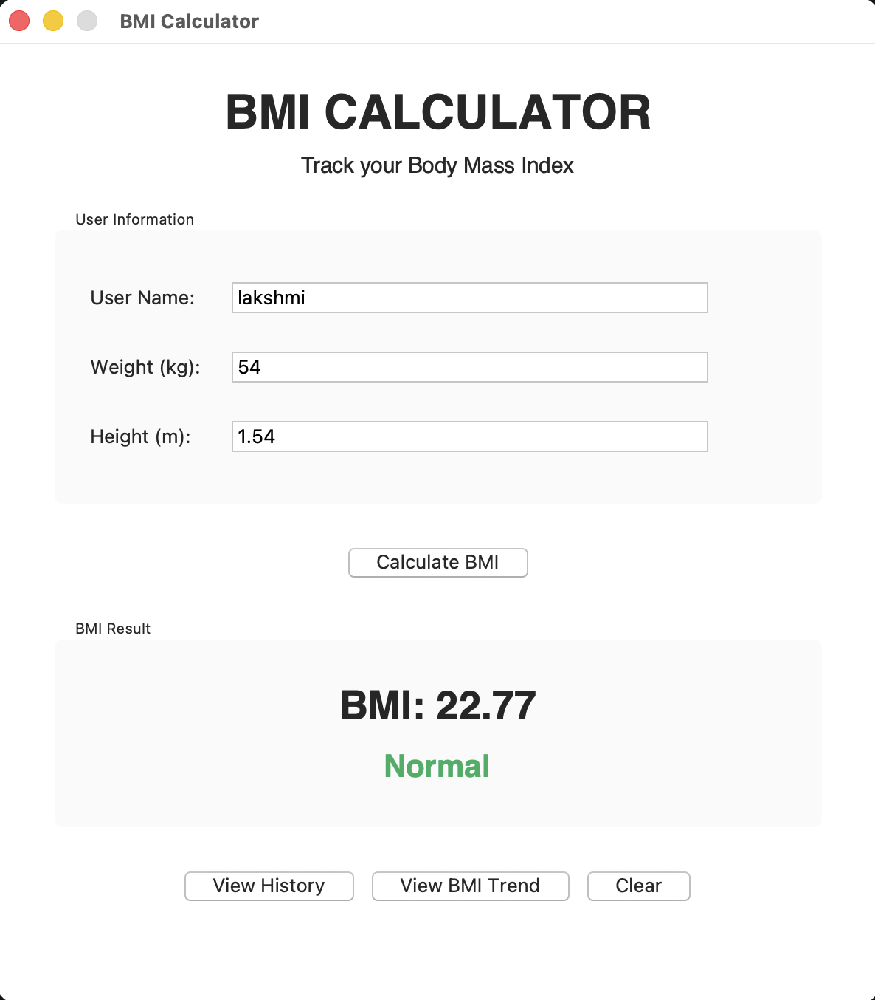
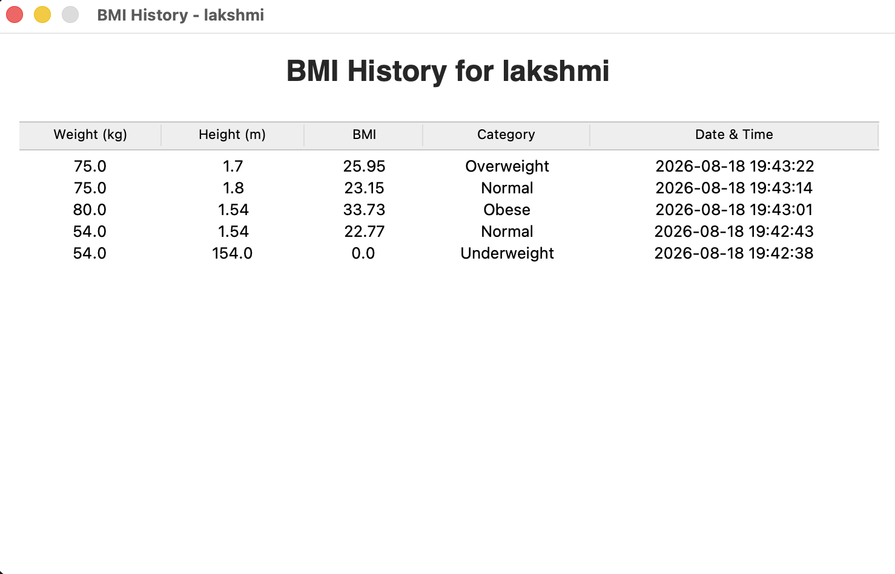
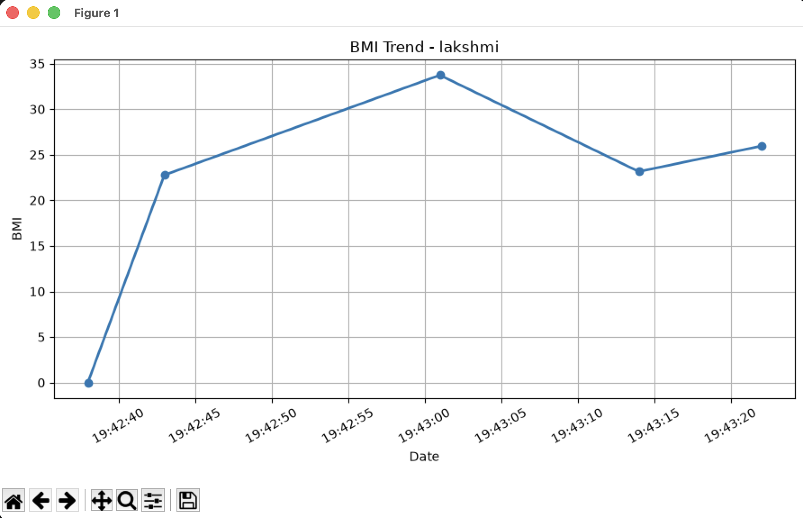

# BMI Calculator

A desktop-based BMI Calculator built with Python and Tkinter. The application calculates Body Mass Index, classifies the result into standard health categories, stores BMI records using SQLite, and visualizes BMI trends using Matplotlib.

## Features

- User-friendly graphical interface using Tkinter
- User name, weight, and height input
- BMI calculation using the standard formula
- BMI classification:
  - Underweight
  - Normal
  - Overweight
  - Obese
- Input validation for invalid and negative values
- Color-coded BMI category feedback
- Multiple-user support
- SQLite database for storing BMI records
- Historical BMI records for each user
- BMI trend visualization using Matplotlib
- Error handling for database operations
- Clear form functionality

## BMI Formula

BMI is calculated using:

BMI = Weight (kg) / Height² (m²)

For example:

Weight = 60 kg  
Height = 1.65 m

BMI = 60 / (1.65 × 1.65)

BMI = 22.04

## BMI Categories

| BMI Range | Category |
|---|---|
| Below 18.5 | Underweight |
| 18.5 – 24.9 | Normal |
| 25.0 – 29.9 | Overweight |
| 30.0 and above | Obese |

## Technologies Used

- Python 3
- Tkinter
- SQLite3
- Matplotlib
- datetime

## Project Structure

```text
Python-Task2-BMICalculator/
│
├── app.py
├── requirements.txt
├── README.md
├── .gitignore
│
├── screenshots/
│   ├── main-interface.png
│   ├── bmi-result.png
│   ├── bmi-history.png
│   └── bmi-trend.png
│
└── venv/

The `venv` directory is a local Python virtual environment and is excluded from GitHub using `.gitignore`.

## Installation

### 1. Clone the Repository

Clone the OIBSIP repository from GitHub and open the BMI Calculator project folder.

```bash
git clone https://github.com/lakshmidevi7363-bit/OIBSIP.git
cd OIBSIP/Python-Task2-BMICalculator
```

### 2. Create a Virtual Environment

```bash
python3 -m venv venv
```

### 3. Activate the Virtual Environment

#### macOS / Linux

```bash
source venv/bin/activate
```

#### Windows

```bash
venv\Scripts\activate
```

### 4. Install Dependencies

```bash
pip install -r requirements.txt
```

## Running the Application

Make sure the virtual environment is activated and run:

```bash
python app.py
```

The BMI Calculator window will open.

## Database

The application automatically creates a SQLite database named:

```text
bmi_records.db
```

The database stores:

- User name
- Weight
- Height
- BMI
- BMI category
- Date and time of calculation

The database file is excluded from GitHub using `.gitignore`.

## Screenshots

### Main Interface



### BMI Result



### BMI History



### BMI Trend



## Input Validation

The application handles:

- Empty user names
- Non-numeric weight values
- Non-numeric height values
- Negative weight values
- Zero or negative height values
- Database read/write errors

## Future Improvements

- Height input in centimeters
- Export BMI history to CSV
- User profile management
- Dark mode
- Improved graphical dashboard
- Additional health metrics
