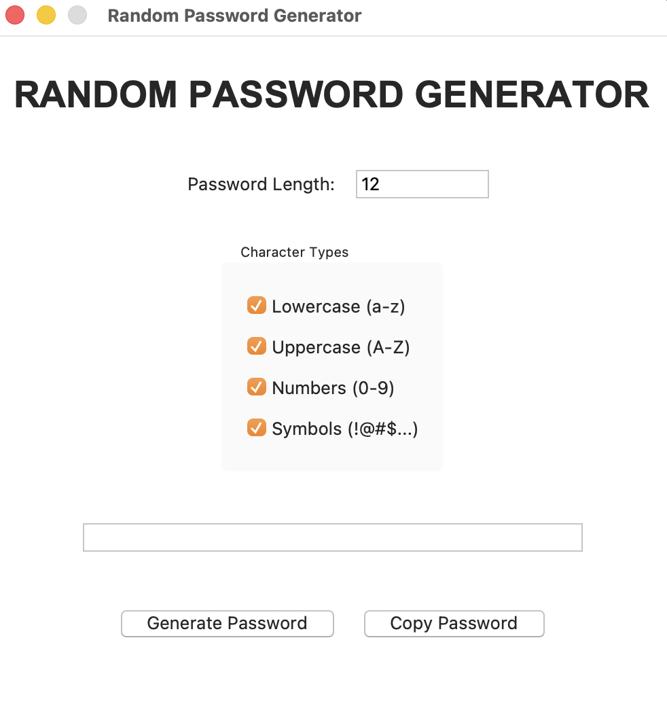
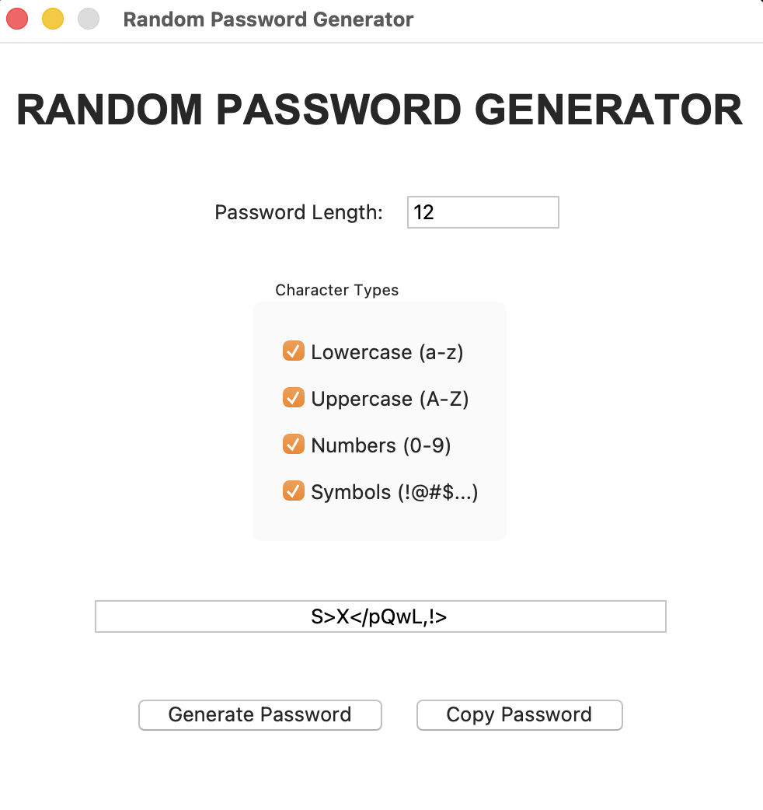
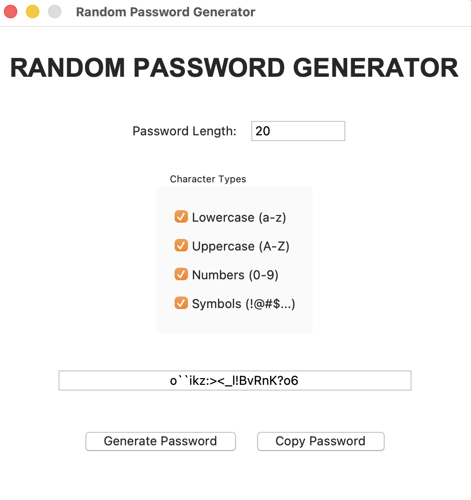
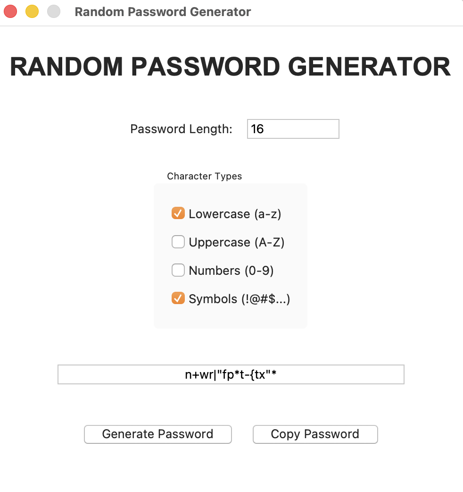

# Random Password Generator

## Project Overview

The Random Password Generator is a Python-based desktop application that generates secure and customizable passwords. Users can select the password length and choose the types of characters they want to include.

The application provides a simple graphical user interface (GUI) built using Tkinter.

## Features

- Generate random passwords
- Select password length
- Include lowercase letters
- Include uppercase letters
- Include numbers
- Include symbols
- Copy generated password to clipboard
- Simple and user-friendly GUI

## Technologies Used

- Python
- Tkinter
- Pyperclip
- Random Module
- String Module

## Project Structure

```text
Python-Task3-RandomPasswordGenerator/
│
├── screenshots/
│   ├── main-interface.png
│   ├── generated-password.png
│   ├── custom-length.png
│   └── options-test.png
│
├── app.py
├── requirements.txt
├── README.md
└── .gitignore
```

## Requirements

Install the required packages using:

```bash
pip install -r requirements.txt
```

## How to Run

### 1. Activate the Virtual Environment

#### macOS / Linux

```bash
source venv/bin/activate
```

#### Windows

```bash
venv\Scripts\activate
```

### 2. Run the Application

```bash
python app.py
```

## How to Use

1. Enter the desired password length.
2. Select the character types you want to include.
3. Click **Generate Password**.
4. The generated password will appear on the screen.
5. Click **Copy Password** to copy the password to the clipboard.

## Screenshots

### Main Interface



### Generated Password



### Custom Password Length



### Character Options



## Future Improvements

- Password strength indicator
- Password history
- Save generated passwords
- Dark mode
- More customization options
